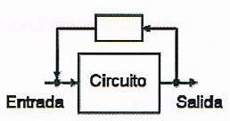
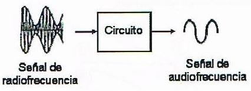
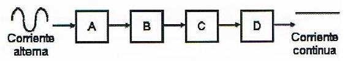
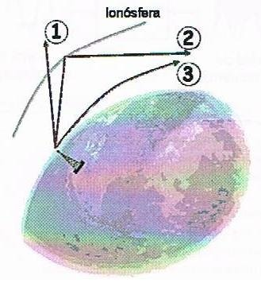
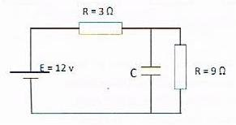
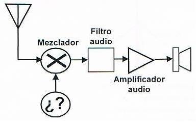
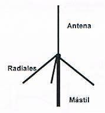
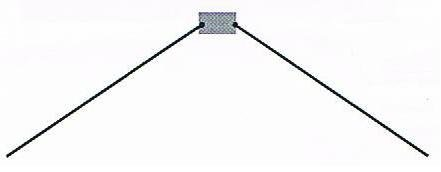
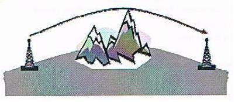

# Prueba 1ª: Electricidad y radioelectricidad (22/10/2011)

1. En la teoría de electricidad, un ohmio equivale a: `1 voltio / 1 amperio`

2. Colocamos 3 Condensadores en paralelo, si el valor individual de 2 de ellos es 100 pF, y el valor total es de 400 pF, ¿Cuál serà el valor del otro condensador?: `200 pF`

3. El llamado "detector de envolvente" es implementado en receptores para señales con modulación de: `Amplitud (AM)`

4. En un transformador, si V es la tensión y N el número de espiras, podemos decir que: `Vsec/Vprim = Nsec/Nprim`

5. ¿Cómo se denomina al proceso de tomar parte de la señal de salida de un circuito para introducirla de nuevo en su entrada?: `Realimentación`

6. En la realización de medidas, usando un polímetro, indique la respuesta correcta: `Ninguna de las anteriores respuestas es correcta`

7. El ancho de banda necesario de un transmisor es: `La anchura de banda de frecuencias estrictamente suficiente para asegurar la transmisión de la información en condiciones adecuadas`

8. La capacidad de un condensador se mide en: `Faradios`

9. ¿Cómo se denomina el siguiente circuito eléctrico?: `Detector de envolvente`

10. ¿Qué es un oscilador?: `Dispositivo que convierte la corriente continua en alterna`

11. Indique el orden de los elementos de una fuente de alimentación lineal: `A Transformador, B Rectificador, C Regulador, D Filtro`

12. Es recomendable ante la previsión de una tormenta: `Desconectar los cables de bajada de antena`

13. En el siguiente gráfico, si la antena emite tres señales en distintas frecuencias, ¿cuál de ellas tiene una frecuencia superior a la frecuencia crítica?: `La señal 1`

14. En el siguiente circuito, en régimen permanente, ¿qué tensión eléctrica, en voltios, tiene el condensador C?: `9`

15. La potencia suministrada a la línea de alimentación de la antena, por un transmisor, durante un ciclo de frecuencia en ausencia de modulación, se denomina: `Potencia de portadora`

16. En el siguiente diagrama de bloques, correspondiente a un receptor elemental de conversión directa, el bloque con interrogantes representa un: `Oscilador local`

17. Cuando dos o más señales atraviesan simultáneamente un sistema no lineal, existe el riesgo de que se genere: `Distorsión por intermodulación`

18. En una instalación eléctrica, el llamado "factor de potencia" o "Coseno de φ" es: `Un valor indicador del desfasaje entre la tensión y la corriente en un determinado componente de la instalación`

19. En general los diodos se caracterizan por ser dispositivos que: `Permiten el paso de la corriente en una única dirección`

20. La inclinación de los radiales en una antena vertical de cuarto de onda, produce: `Una variación de la impedancia de entrada`

21. La "desensibilización o bloqueo" de un receptor puede producirse por: `Excesivo nivel de señal en la antena`

22. El valor y tolerancia de las resistencias más habituales se indica mediante un código de colores. Indique el valor de la resistencia cuyos colores son, por este orden: violeta, verde, rojo, oro: `7.500 Ω y 5% de tolerancia`

23. El excitador: `Suministra la potencia necesaria a la etapa amplificadora de potencia`

24. ¿Qué ventajas presenta la antena dipolo en V invertida?: `Un valor de impedancia próximo a 50Ω y un diagrama de radiación prácticamente omnidireccional`

25. Los medios más comunes para proteger de interferencias a un receptor son: `Tomas de tierra y condensadores`

26. La radiación armónica es: `La radiación no esencial en múltiplos enteros de la frecuencia principal`

27. El tamaño físico de una antena debe ser función de la: `Frecuencia`

28. La curvatura que experimenta una onda radioeléctrica al encontrarse un obstáculo en su trayectoria, se denomina: `Difracción`

29. ¿Cómo se puede eliminar una interferencia generada por la fuente de alimentación de un transmisor? `Colocando un filtro apropiado`

30. En función de la actividad solar, la capa de la atmósfera responsable de las variaciones de propagación radioeléctrica en frecuencias inferiores a 30 MHz, se denomina: `Ionosfera`
